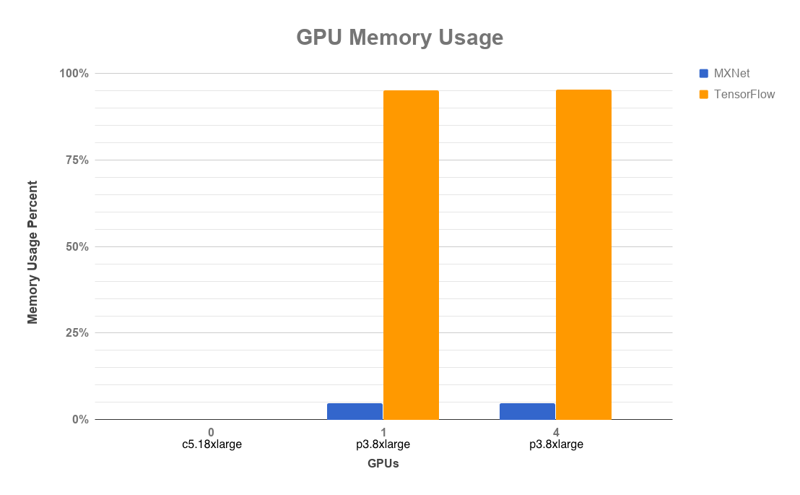
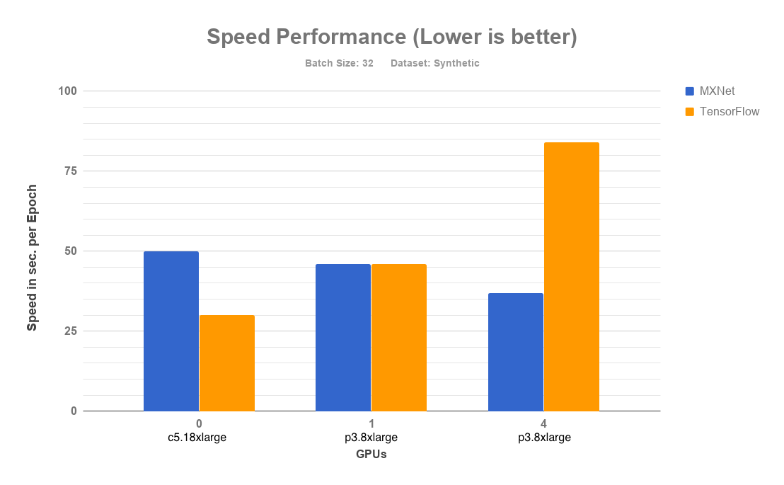
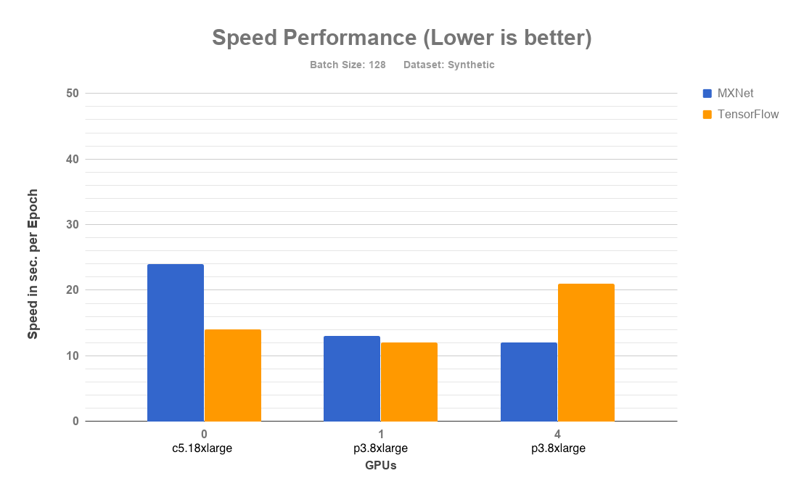
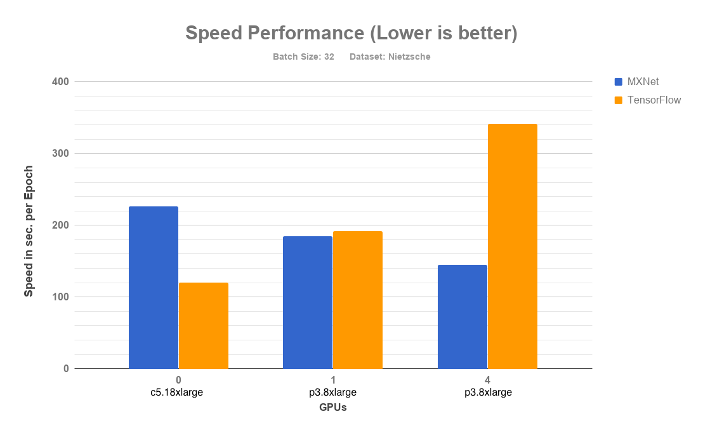
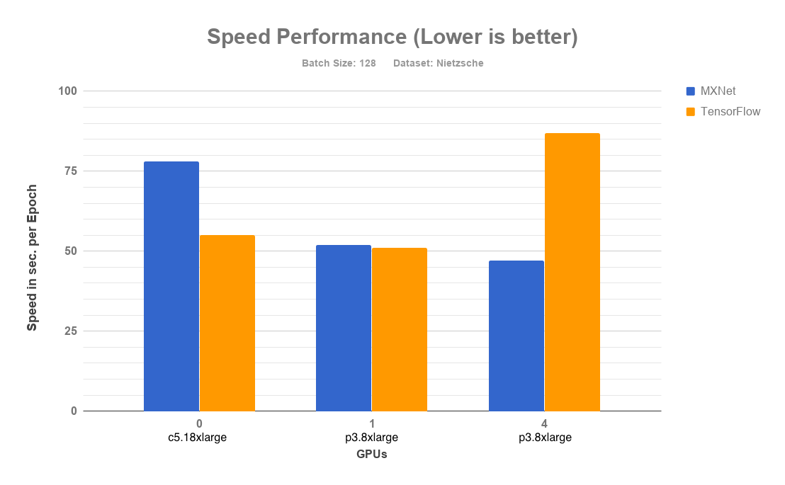
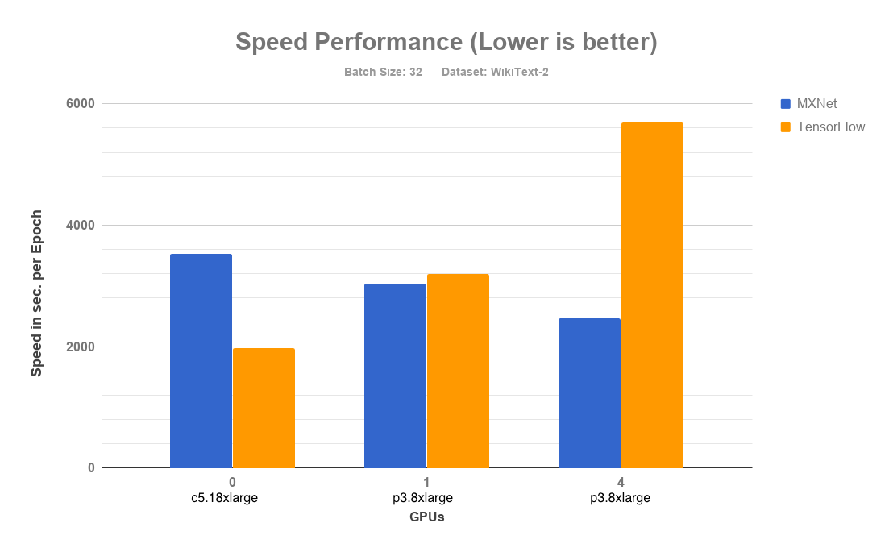
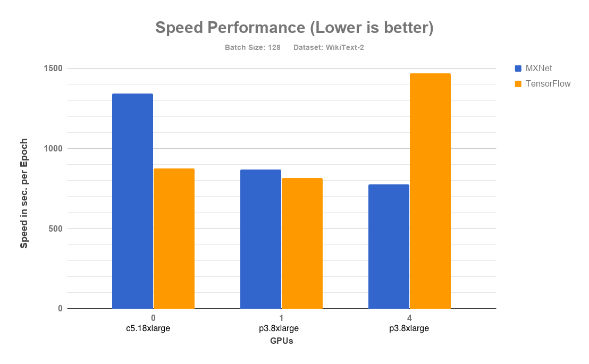

# RNN Benchmark Results (Experimental support)

## Summary
```
    NOTE:
        RNN support in Keras-MXNet is experimental with few rough edges on CPU training performance and no support for 
        variable length sequences. Below results are only early preview of the current status.
```

Please see [RNN with Keras-MXNet document](../docs/mxnet_backend/using_rnn_with_mxnet_backend.md) for more details on
 the poor CPU training performance and unsupported functionalities. 

 ### Configuration
|                  |                                                              |
| :--------------- | :----------------------------------------------------------- |
| Keras            | v2.1.6                                                       |
| TensorFlow       | v1.8.0                                                       |
| MXNet            | v1.2.0                                                       |
| CUDA             | v9.0.176                                                     |
| cuDNN            | v7.0.1                                                       |

### LSTM-Nietzsche

| Instance Type | GPUs  | Batch Size  | Keras-MXNet (Time/Epoch), (GPU Mem)   | Keras-TensorFlow (Time/Epoch), (GPU Mem)   |
|---|---|---|---|---|
|  C5.18X Large | 0  | 128  | 78 sec, N/A | 55 sec, N/A|
|  P3.8X Large |  1 |  128 | 52 sec, 792 MB | 83 sec, 15360 MB|
|  P3.8X Large | 4  | 128  | 47 sec, 770 MB | 117 sec, 15410 MB |
|  P3.16X Large | 8  | 128  | 72 sec, 826 MB | 183sec, 15408TBD |

### LSTM-WikiText2

| Instance Type | GPUs  | Batch Size  | Keras-MXNet (Time/Epoch), (GPU Mem)  | Keras-TensorFlow (Time/Epoch), (GPU Mem)  |
|---|---|---|---|---|
|  C5.18X Large | 0  | 128  | 1345 sec, N/A  | 875, N/A  |
|  P3.8X Large |  1 |  128 | 868 sec, 772 MB | 817, 15360 MB  |
|  P3.8X Large | 4  | 128  | 775 sec, 764 MB | 1468, 15410 MB  |
|  P3.16X Large | 8  | 128  | 1214 sec, 826 MB | 3176 sec, 15410 MB |

### Synthetic Data

| Instance Type | GPUs  | Batch Size  | Keras-MXNet (Time/Epoch), (GPU Mem)   | Keras-TensorFlow (Time/Epoch), (GPU Mem)   |
|---|---|---|---|---|
|  C5.18X Large | 0  | 128  | 24 sec, N/A | 14 sec, N/A|
|  P3.8X Large |  1 |  128 | 13 sec, 792 MB | 12 sec, 15360 MB|
|  P3.8X Large | 4  | 128  | 12 sec, 770 MB | 21 sec, 15410 MB |
|  P3.16X Large | 8  | 128  | 19 sec, 826 MB | 49 sec, 15360 MB |


# Detailed RNN Benchmark Results

Below is the result of GPU memory usage while running LSTM model on Synthetic, Nietzsche, and WikiText-2 character level dataset.



Note: All the data for performance diagram shown below is taken from the cell having `unroll Type=True`
## Synthetic Dataset

### Configuration

|                  |                                                              |
| :--------------- | :----------------------------------------------------------- |
| Dataset          | Synthetic(Randomly generated)                                |
| Keras            | v2.1.5                                                       |
| TensorFlow       | v1.7.0                                                       |
| MXNet            | v1.1.0                                                       |
| CUDA             | v9.0.176                                                     |
| Training Method  | [`fit`](https://keras.io/models/model/#fit)                  |
| Training Scripts | [lstm_synthetic](https://github.com/awslabs/keras-apache-mxnet/blob/master/benchmark/scripts/models/lstm_synthetic.py) |


### Results

|                                                          |                                                              |
| :------------------------------------------------------- | :----------------------------------------------------------- |
|           |             |


| Instance    | GPUs | Backend    | Batch size | Data Set  | Training  Method | Speed/Epoch (Lower is better) | Unroll Type | No. of samples | Memory(MiB) |
| ----------- | ---- | ---------- | ---------- | --------- | ---------------- | ----------------------------- | ----------- | -------------- | ----------- |
| C5.18xLarge | 0    | MXNet      | 32         | Synthetic | fit()            | 50s 1ms/step                  | TRUE        | 50000          | 0           |
| C5.xLarge   | 0    | MXNet      | 32         | Synthetic | fit()            | 132s 3ms/step                 | TRUE        | 50000          | 0           |
| P3.8xLarge  | 1    | MXNet      | 32         | Synthetic | fit()            | 46s 919us/step                | TRUE        | 50000          | 772         |
| P3.8xLarge  | 4    | MXNet      | 32         | Synthetic | fit()            | 37s 739us/step                | TRUE        | 50000          | 764         |
|             |      |            |            |           |                  |                               |             |                |             |
| C5.18xLarge | 0    | MXNet      | 128        | Synthetic | fit()            | 24s 485us/step                | TRUE        | 50000          | 0           |
| C5.xLarge   | 0    | MXNet      | 128        | Synthetic | fit()            | 93s 2ms/step                  | TRUE        | 50000          | 0           |
| P3.8xLarge  | 1    | MXNet      | 128        | Synthetic | fit()            | 13s 261us/step                | TRUE        | 50000          | 792         |
| P3.8xLarge  | 4    | MXNet      | 128        | Synthetic | fit()            | 12s 240us/step                | TRUE        | 50000          | 770         |
|             |      |            |            |           |                  |                               |             |                |             |
| C5.18xLarge | 0    | Tensorflow | 32         | Synthetic | fit()            | 30s 609us/step                | TRUE        | 50000          | 0           |
| C5.xLarge   | 0    | Tensorflow | 32         | Synthetic | fit()            | 37s 746us/step                | TRUE        | 50000          | 0           |
| P3.8xLarge  | 1    | Tensorflow | 32         | Synthetic | fit()            | 46s 925us/step                | TRUE        | 50000          | 15360       |
| P3.8xLarge  | 4    | Tensorflow | 32         | Synthetic | fit()            | 84s 2ms/step                  | TRUE        | 50000          | 15410       |
|             |      |            |            |           |                  |                               |             |                |             |
| C5.18xLarge | 0    | Tensorflow | 128        | Synthetic | fit()            | 14s 284us/step                | TRUE        | 50000          | 0           |
| C5.xLarge   | 0    | Tensorflow | 128        | Synthetic | fit()            | 26s 513us/step                | TRUE        | 50000          | 0           |
| P3.8xLarge  | 1    | Tensorflow | 128        | Synthetic | fit()            | 12s 249us/step                | TRUE        | 50000          | 15360       |
| P3.8xLarge  | 4    | Tensorflow | 128        | Synthetic | fit()            | 21s 430us/step                | TRUE        | 50000          | 15410       |
|             |      |            |            |           |                  |                               |             |                |             |
| C5.18xLarge | 0    | Tensorflow | 32         | Synthetic | fit()            | 30s 608us/step                | FALSE       | 50000          | 0           |
| C5.xLarge   | 0    | Tensorflow | 32         | Synthetic | fit()            | 37s 748us/step                | FALSE       | 50000          | 0           |
| P3.8xLarge  | 1    | Tensorflow | 32         | Synthetic | fit()            | 48s 967us/step                | FALSE       | 50000          | 15360       |
| P3.8xLarge  | 4    | Tensorflow | 32         | Synthetic | fit()            | 85s 2ms/step                  | FALSE       | 50000          | 15410       |
|             |      |            |            |           |                  |                               |             |                |             |
| C5.18xLarge | 0    | Tensorflow | 128        | Synthetic | fit()            | 14s 283us/step                | FALSE       | 50000          | 0           |
| C5.xLarge   | 0    | Tensorflow | 128        | Synthetic | fit()            | 26s 514us/step                | FALSE       | 50000          | 0           |
| P3.8xLarge  | 1    | Tensorflow | 128        | Synthetic | fit()            | 12s 244us/step                | FALSE       | 50000          | 15360       |
| P3.8xLarge  | 4    | Tensorflow | 128        | Synthetic | fit()            | 22s 444us/step                | FALSE       | 50000          | 15410       |

## Nietzsche Dataset

### Configuration

|                  |                                                              |
| :--------------- | :----------------------------------------------------------- |
| Dataset          | [Nietzsche]( https://s3.amazonaws.com/text-datasets/nietzsche.txt) |
| Keras            | v2.1.5                                                       |
| TensorFlow       | v1.7.0                                                       |
| MXNet            | v1.1.0                                                       |
| CUDA             | v9.0.176                                                     |
| Training Method  | [`fit`](https://keras.io/models/model/#fit)                  |
| Training Scripts | [lstm_text_generation](https://github.com/awslabs/keras-apache-mxnet/blob/master/benchmark/scripts/models/lstm_text_generation.pyy) |

### Results

|                                                          |                                                              |
| :------------------------------------------------------- | :----------------------------------------------------------- |
|           |             |


| Instance    | GPUs | Backend    | Batch size | Data Set  | Training  Method | Speed/Epoch (Lower is better) | Unroll Type | No. of samples | Memory(MiB) |
| ----------- | ---- | ---------- | ---------- | --------- | ---------------- | ----------------------------- | ----------- | -------------- | ----------- |
| C5.18xLarge | 0    | MXNet      | 32         | Nietzsche | fit()            | 226s 1ms/step                 | TRUE        | 200285         | 0           |
| C5.xLarge   | 0    | MXNet      | 32         | Nietzsche | fit()            | 528s 3ms/step                 | TRUE        | 200285         | 0           |
| P3.8xLarge  | 1    | MXNet      | 32         | Nietzsche | fit()            | 185s 924us/step               | TRUE        | 200285         | 772         |
| P3.8xLarge  | 4    | MXNet      | 32         | Nietzsche | fit()            | 145s 726us/step               | TRUE        | 200285         | 764         |
|             |      |            |            |           |                  |                               |             |                |             |
| C5.18xLarge | 0    | MXNet      | 128        | Nietzsche | fit()            | 78s 389us/step                | TRUE        | 200285         | 0           |
| C5.xLarge   | 0    | MXNet      | 128        | Nietzsche | fit()            | 360s 2ms/step                 | TRUE        | 200285         | 0           |
| P3.8xLarge  | 1    | MXNet      | 128        | Nietzsche | fit()            | 52s 262us/step                | TRUE        | 200285         | 792         |
| P3.8xLarge  | 4    | MXNet      | 128        | Nietzsche | fit()            | 47s 235us/step                | TRUE        | 200285         | 770         |
|             |      |            |            |           |                  |                               |             |                |             |
| C5.18xLarge | 0    | Tensorflow | 32         | Nietzsche | fit()            | 120s 598us/step               | TRUE        | 200285         | 0           |
| C5.xLarge   | 0    | Tensorflow | 32         | Nietzsche | fit()            | 145s 723us/step               | TRUE        | 200285         | 0           |
| P3.8xLarge  | 1    | Tensorflow | 32         | Nietzsche | fit()            | 192s 958us/step               | TRUE        | 200285         | 15360       |
| P3.8xLarge  | 4    | Tensorflow | 32         | Nietzsche | fit()            | 341s 2ms/step                 | TRUE        | 200285         | 15410       |
|             |      |            |            |           |                  |                               |             |                |             |
| C5.18xLarge | 0    | Tensorflow | 128        | Nietzsche | fit()            | 55s 273us/step                | TRUE        | 200285         | 0           |
| C5.xLarge   | 0    | Tensorflow | 128        | Nietzsche | fit()            | 101s 503us/step               | TRUE        | 200285         | 0           |
| P3.8xLarge  | 1    | Tensorflow | 128        | Nietzsche | fit()            | 51s 252us/step                | TRUE        | 200285         | 15360       |
| P3.8xLarge  | 4    | Tensorflow | 128        | Nietzsche | fit()            | 87s 435us/step                | TRUE        | 200285         | 15410       |
|             |      |            |            |           |                  |                               |             |                |             |
| C5.18xLarge | 0    | Tensorflow | 32         | Nietzsche | fit()            | 120s 601us/step               | FALSE       | 200285         | 0           |
| C5.xLarge   | 0    | Tensorflow | 32         | Nietzsche | fit()            | 145s 725us/step               | FALSE       | 200285         | 0           |
| P3.8xLarge  | 1    | Tensorflow | 32         | Nietzsche | fit()            | 197s 982us/step               | FALSE       | 200285         | 15360       |
| P3.8xLarge  | 4    | Tensorflow | 32         | Nietzsche | fit()            | 347s 2ms/step                 | FALSE       | 200285         | 15410       |
|             |      |            |            |           |                  |                               |             |                |             |
| C5.18xLarge | 0    | Tensorflow | 128        | Nietzsche | fit()            | 54s 272us/step                | FALSE       | 200285         | 0           |
| C5.xLarge   | 0    | Tensorflow | 128        | Nietzsche | fit()            | 101s 503us/step               | FALSE       | 200285         | 0           |
| P3.8xLarge  | 1    | Tensorflow | 128        | Nietzsche | fit()            | 49s 244us/step                | FALSE       | 200285         | 15360       |
| P3.8xLarge  | 4    | Tensorflow | 128        | Nietzsche | fit()            | 88s 437us/step                | FALSE       | 200285         | 15410       |

## WikiText-2 Dataset

### Configuration

|                  |                                                              |
| :--------------- | :----------------------------------------------------------- |
| Dataset          | [WikiText-2](https://einstein.ai/research/the-wikitext-long-term-dependency-language-modeling-dataset) |
| Keras            | v2.1.5                                                       |
| TensorFlow       | v1.7.0                                                       |
| MXNet            | v1.1.0                                                       |
| CUDA             | v9.0.176                                                     |
| Training Method  | [`fit`](https://keras.io/models/model/#fit)                  |
| Training Scripts | [lstm_text_generation](https://github.com/awslabs/keras-apache-mxnet/blob/master/benchmark/scripts/models/lstm_text_generation.py) |

### Results

|                                                          |                                                              |
| :------------------------------------------------------- | :----------------------------------------------------------- |
|           |             |


| Instance    | GPUs | Backend    | Batch size | Data Set   | Training  Method | Speed/Epoch (Lower is better) | Unroll Type | No. of samples | Memory(MiB) |
| ----------- | ---- | ---------- | ---------- | ---------- | ---------------- | ----------------------------- | ----------- | -------------- | ----------- |
| C5.18xLarge | 0    | MXNet      | 32         | WikiText-2 | fit()            | 3530s 1ms/step                | TRUE        | 1562175        | 0           |
| C5.xLarge   | 0    | MXNet      | 32         | WikiText-2 | fit()            | 9249s 3ms/step                | TRUE        | 1562175        | 0           |
| P3.8xLarge  | 1    | MXNet      | 32         | WikiText-2 | fit()            | 3042s 900us/step              | TRUE        | 1562175        | 772         |
| P3.8xLarge  | 4    | MXNet      | 32         | WikiText-2 | fit()            | 2460s 727us/step              | TRUE        | 1562175        | 764         |
|             |      |            |            |            |                  |                               |             |                |             |
| C5.18xLarge | 0    | MXNet      | 128        | WikiText-2 | fit()            | 1345s 398us/step              | TRUE        | 1562175        | 0           |
| C5.xLarge   | 0    | MXNet      | 128        | WikiText-2 | fit()            | 6417s 2ms/step                | TRUE        | 1562175        | 0           |
| P3.8xLarge  | 1    | MXNet      | 128        | WikiText-2 | fit()            | 868s 257us/step               | TRUE        | 1562175        | 792         |
| P3.8xLarge  | 4    | MXNet      | 128        | WikiText-2 | fit()            | 775s 229us/step               | TRUE        | 1562175        | 770         |
|             |      |            |            |            |                  |                               |             |                |             |
| C5.18xLarge | 0    | Tensorflow | 32         | WikiText-2 | fit()            | 1972s 583us/step              | TRUE        | 1562175        | 0           |
| C5.xLarge   | 0    | Tensorflow | 32         | WikiText-2 | fit()            | 2347s 694us/step              | TRUE        | 1562175        | 0           |
| P3.8xLarge  | 1    | Tensorflow | 32         | WikiText-2 | fit()            | 3197s 945us/step              | TRUE        | 1562175        | 15360       |
| P3.8xLarge  | 4    | Tensorflow | 32         | WikiText-2 | fit()            | 5687s 2ms/step                | TRUE        | 1562175        | 15410       |
|             |      |            |            |            |                  |                               |             |                |             |
| C5.18xLarge | 0    | Tensorflow | 128        | WikiText-2 | fit()            | 875s 259us/step               | TRUE        | 1562175        | 0           |
| C5.xLarge   | 0    | Tensorflow | 128        | WikiText-2 | fit()            | 1571s 465us/step              | TRUE        | 1562175        | 0           |
| P3.8xLarge  | 1    | Tensorflow | 128        | WikiText-2 | fit()            | 817s 242us/step               | TRUE        | 1562175        | 15360       |
| P3.8xLarge  | 4    | Tensorflow | 128        | WikiText-2 | fit()            | 1468s 434us/step              | TRUE        | 1562175        | 15410       |
|             |      |            |            |            |                  |                               |             |                |             |
| C5.18xLarge | 0    | Tensorflow | 32         | WikiText-2 | fit()            | 1949s 576us/step              | FALSE       | 1562175        | 0           |
| C5.xLarge   | 0    | Tensorflow | 32         | WikiText-2 | fit()            | 2341s 692us/step              | FALSE       | 1562175        | 0           |
| P3.8xLarge  | 1    | Tensorflow | 32         | WikiText-2 | fit()            | 3174s 939us/step              | FALSE       | 1562175        | 15360       |
| P3.8xLarge  | 4    | Tensorflow | 32         | WikiText-2 | fit()            | 5671s 2ms/step                | FALSE       | 1562175        | 15410       |
|             |      |            |            |            |                  |                               |             |                |             |
| C5.18xLarge | 0    | Tensorflow | 128        | WikiText-2 | fit()            | 874s 259us/step               | FALSE       | 1562175        | 0           |
| C5.xLarge   | 0    | Tensorflow | 128        | WikiText-2 | fit()            | 1582s 468us/step              | FALSE       | 1562175        | 0           |
| P3.8xLarge  | 1    | Tensorflow | 128        | WikiText-2 | fit()            | 825s 244us/step               | FALSE       | 1562175        | 15360       |
| P3.8xLarge  | 4    | Tensorflow | 128        | WikiText-2 | fit()            | 1446s 428us/step              | FALSE       | 1562175        | 15410       |